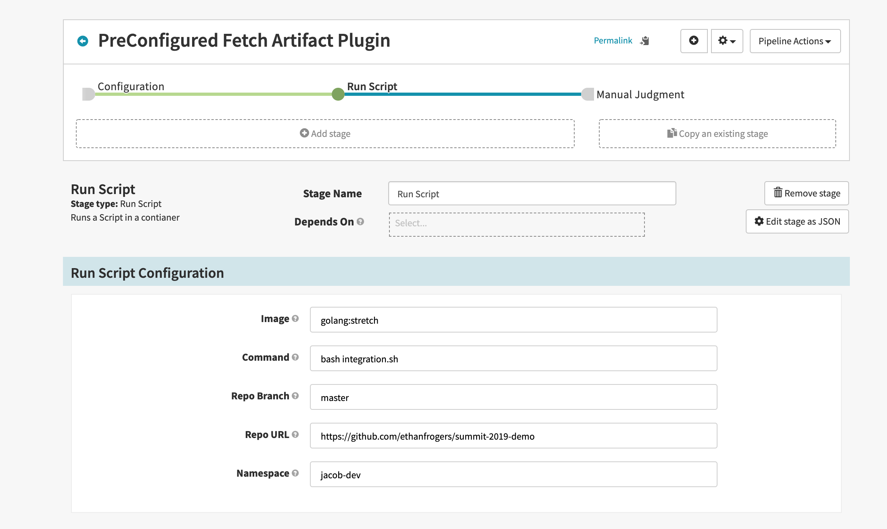
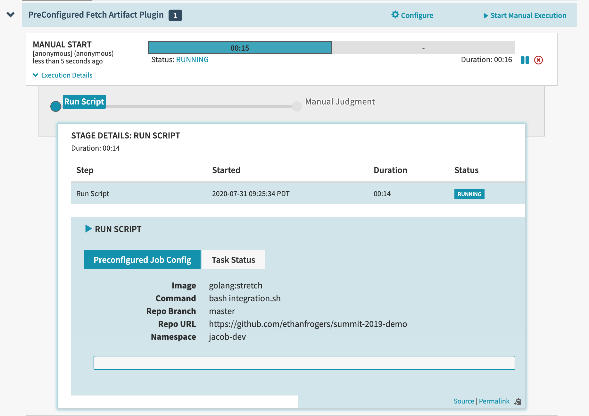
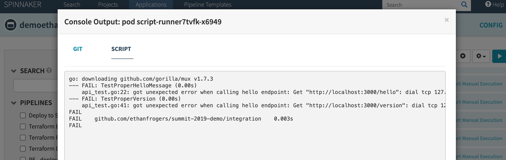

# run-script-plugin

_Note: This plugin is under active development and subject to change. Use with caution until there has been
a 1.0 release._

The `run-script-plugin` provides Spinnaker with a preconfigured job stage that allows the operator to run a custom script. This is useful if you need to run an arbitrary script and use the output as part of your pipeline.

## Screenshots




## Installation
TODO

## Configuration
Sample Configuration:
```
spinnaker:
  extensibility:
    plugins:
      Armory.PreConfiguredJobPlugin.RunScript:
        enabled: true
        extensions:
          armory.RunScriptPreConfiguredJobStage:
            enabled: true
            config:
              account: kubernetes
              credentials: kubernetes
            #  initContainerImage: myrepo/fetch-artifact:latest # Optional to override default init container image  
```
